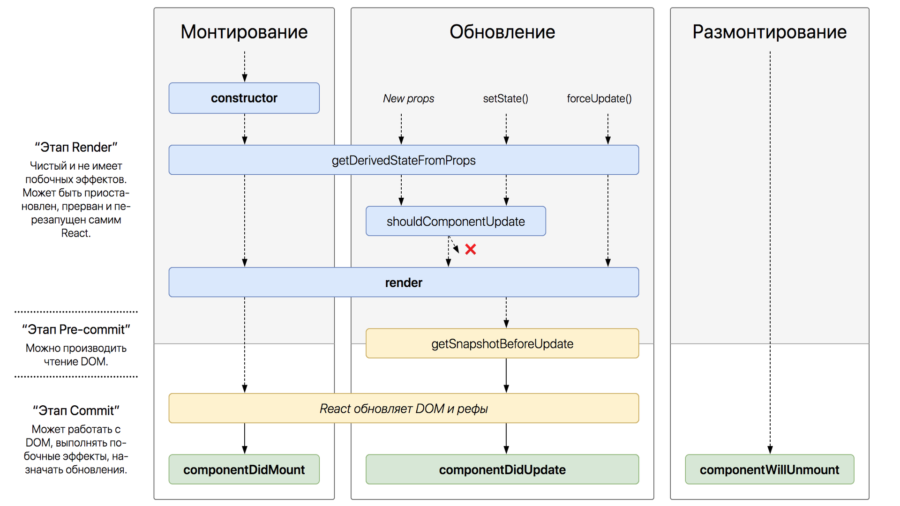
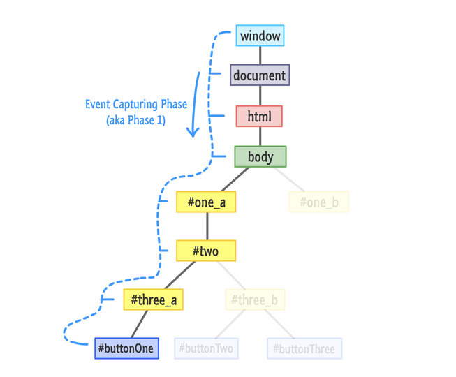
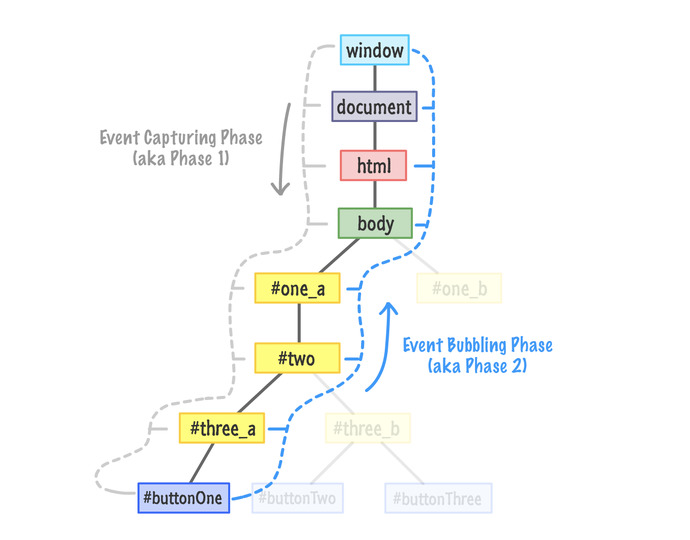

---

layout: yandex2

style: |
    /* собственные стили можно писать здесь!! */
    .add-margin-bottom {
        margin-bottom: 80px !important;
    }

    .smaller h2 {
        font-size: 90px !important;
    }

    strong em,
    .blockquote em {
        font-style: italic !important;
    }

    .shout h2 {
        width: 100%;
        text-align: center;
    }

    .wide-picture-caption {
        width: 1000px !important;
    }

    .reduce-line-height code {
        font-size: 26px !important;
        line-height: 1.8 !important;
    }

    .monospaced, 
    .monospaced h2{
        font-family: Hack, monospaced !important;
    }

    .wide-gif img {
        width: 1000px;
    }

    .tape img {
        width: 500px;
        margin-left: 150px !important;
    }
    .glue img {
        width: 600px;
    }

---


<!-- Первый слайд (Титульник) -->
# {:.logo}

<!-- Второй слайд: Название и Автор -->
## {{ site.presentation.title }}
{:.title.smaller}

### {{ site.presentation.service }}

<div class="authors">


<p>{{ site.author.name }}, {{ site.author.position }}</p>


</div>

## План лекции

- ...JSX в деталях
- ...Компоненты, Жизненный цикл, Error Boundaries
- ...Производительность и Reconciliation
- ...События в React
- ...Ссылки, Контекст, Порталы
- ...Хуки
- ...Вспомогательное API, Анимации, БЭМ
- ...Мышление в стиле React

## Почему React?

- ...Большое сообщество
- ...Быстрый порог входа
- ...Легко найти разработчиков

## За что любим React?

- ...Эффективное обновление DOM
- ...SyntheticEvent
- ...JSX

## Компонентный подход

- ...Как отображать данные
- ...Как изменять состояние
- ...Как обрабатывать события


## React — это просто библиотека
{:.section.smaller}

### Плавное погружение


## Загрузка React через script

```html
<head>
    <script src="https://yastatic.net/react/16.8.5/react.min.js"></script>
    <script src="https://yastatic.net/react/16.8.5/react-dom.min.js"></script>
    <!-- ... -->
</head>
<body>
    <div id="root"></div>
    <script>
        const h1 = React.createElement('h1', null, 'Hello, React')
        ReactDOM.render(h1, document.getElementById('root'))
    </script> 
</body>
```

## Загрузка React и Babel через script

```html
<head>
    <script src="https://yastatic.net/react/16.8.5/react.min.js"></script>
    <script src="https://yastatic.net/react/16.8.5/react-dom.min.js"></script>
    <script src="https://unpkg.com/babel-standalone@6/babel.min.js"></script>
</head>
<body>
    <div id="root"></div>
    <script type="text/babel">
        const h1 = <h1>Hello, React</h1>
        ReactDOM.render(h1, document.getElementById('root'))
    </script> 
</body>
```


## JSX в деталях
{:.section}

### Часть 1


## JSX

**Просто обертка над React.createElement**

```jsx
// без JSX
const h1 = React.createElement('h1', { className: 'title' }, 'Hello, World')
```
{:.next}

```jsx
// c JSX
const h1 = <h1 className='title'>Hello, World</h1>
```
{:.next}

## Элементы и компоненты

- ...<b>Элемент</b> — узел DOM
- ...<b>Компонент</b> — коробочка для *элементов*

```jsx
// элемент
<div>Hello, React</div>
```
{:.next}

```jsx
// компонент (коробочка)
const Component = () => (
    <div>Hello, React</div>
)

<Component />
```
{:.next}


## Парные и одиночные теги

**React сам закроет теги**

```jsx
// JSX
<script src='https://ya.ru' />
<input type='text' />
```
{:.next}

```html
<!-- HTML -->
<script src='https://ya.ru'></script>
<input type='text'>
```
{:.next}

## Области видимости
{:.section}

### JSX в деталях

## React в области видимости

```jsx
import React from 'react'
```

```jsx
// до преобразования
<div>Hello, React</div>
```
{:.next}

```jsx
// после преобразования
React.creacteElement('div', null, 'Hello, React')
```
{:.next}


## Компоненты в области видимости

```jsx
import React from 'react'
import Component from './Component'
```

```jsx
// до преобразования
<Component>Hello, React</Component>
```
{:.next}

```jsx
// после преобразования
React.creacteElement(Component, null, 'Hello, React')
```
{:.next}


## Компоненты с БОЛЬШОЙ БУКВЫ

```jsx
import React from 'react'
import component from './component'
```

```jsx
// до преобразования
<component>Hello, React</component>
```
{:.next}

{:.next}
```jsx
// после преобразования
React.creacteElement('component', null, 'Hello, React')
```
{:.next}

```html
<!-- HTML -->
<component>Hello, React</component>
```
{:.next}


## Компоненты внутри объекта

```jsx
import React from 'react'

const MyComponents = {
    Header: ({color}) => <div>Imagine {color} header</div>
}
```
{:.next}


```jsx
<MyComponents.Header color="blue" />
```
{:.next}


## Вычисляемые свойства не заработают

```jsx
import React from 'react'

const MyComponents = {
    Header: ({color}) => <div>Imagine {color} header</div>
}
```

```jsx
// не заработает
<MyComponents['Header'] color="blue" />
```
{:.next}


## Вычисляемые свойсва не заработают

```jsx
import React from 'react'

const MyComponents = {
    Header: ({color}) => <div>Imagine {color} header</div>
}
```

```jsx
// Ура! Заработало!
const Component = MyComponents['Header']
<Component color="blue" />
```


## return JSX
{:.section}

### JSX в деталях


## Только один корневой тег

```jsx
const Page = () => (
    <div>
        <Header />
        <Body />
        <Footer />
    </div>
)
```
{:.next}


## React.Fragment

```jsx
const Page = () => (
    <React.Fragment>
        <Header />
        <Body />
        <Footer />
    </React.Fragment>
)
```

## React.Fragment, короче

```jsx
const Page = () => (
    <>
        <Header />
        <Body />
        <Footer />
    </>
)
```

## JSX — это все ещё JS

```jsx
// хм...
return 
    <div>
        Hello, React
    </div>
```
{:.next}


```jsx
// Ура! Заработало!
return (
    <div>
        Hello, React
    </div>
)
```
{:.next}


## Атрибуты
{:.section}

### JSX в деталях


## Атрибуты 

```jsx
// у компонентов все прокидывается в props
<Component text='Hello, React' color='red' />
```
{:.next}

```jsx
// у элементов в html разметку
<div className='app' title='приложение' />
```
{:.next}

```jsx
// исключение — служебные свойства: key, ref
<div key={id} ref={this.divRef} />
```
{:.next}


## Атрибуты

```jsx
// допустимы и двойные и одинарные кавычки
<div className='header' title="заголовок" />
```
{:.next}

```jsx
// js выражения, записываются внутри {}
<div className={'header'} title={props.title} />
```
{:.next}

```jsx
// сокращенная запись логического атрибута
<div isSelected /> // <div isSelected={true} />
```
{:.next}

## Паттерн Spread Attributes
{:.shout}

## Паттерн Spread Attributes

```jsx
const Component = (props) => {
    return <Button {......props} />
}
```

```jsx
const Component = (props) => {
    return <Button color='red' {......props} />
}
```
{:.next}

```jsx
// победит последний!
```
{:.next}


## Атрибуты у элементов
{:.section}

### JSX в деталях


## Все HTML атрибуты в camelCase

```jsx
// camelCase
<input className='input' tabIndex='1' /> 
```
{:.next}

```jsx
// исключения: data-*, aria-*
<div data-value={42} /> 
```
{:.next}


## Атрибуты: стили и обработчики

```jsx
// style — задается объектом со свойствами в camelCase
<div style={ {backgroundColor: 'orange'} } /> 
```
{:.next}

```jsx
// px можно не указывать
<div style={ {width: 300, fontSize: '1.2em'} } /> 
```
{:.next}

```jsx
// обработчики указываются через on + Имя события
<input onChange={this.handleChange} /> 
```
{:.next}

## Атрибуты: опасный HTML

```jsx
const html = {__html: 'First &middot; Second'}
<div dangerouslySetInnerHTML={html} />
```


## Дочерние элементы
{:.section}

### JSX в деталях


## Вложенный контент

```jsx
// У компонента: прилетит в компонент в props.children
<MyComponent>Hello world</MyComponent>
```
{:.next}

```jsx
// У элемента: преобразуется в textNode
<div>This is valid HTML &amp; JSX at the same time.</div>
```
{:.next}

```jsx
// JS выражения
<div>Привет, {username || '%username%'}!</div>
```
{:.next}

```jsx
// Строки экранируются
<div>Экранированный HTML: {dangerHTML}</div>
```
{:.next}


## Обработка пробельных символов
{:.reduce-line-height}

**Слева и справа удалятся, а посередине схлопнутся до одного пробела**

```jsx
<div>Hello World</div>

<div>
  Hello World
</div>

<div>

  Hello 
  World
</div>
```
{:.next}

## Комментарии в JSX

```js
<div>
    <!-- Не заработает! -->
</div>
```
{:.next}

```js
<div>
    {/* JSX комментарий */}
</div>
```
{:.next}


## Свойство children

```jsx
const Link = (props) => (
    <a href={props.href}>{props.children}</a>
)

<Link href={"https://ya.ru"}>
    
    Просто картинка
</Link>
```
{:.next}

```jsx
// props.children: Array | undefined
props.children.length // выстрел в ногу
```
{:.next}

## JSX игнорирует true, false, null, undefined

```jsx
// true, false, null, undefined — будут проигнорированы
<div />
<div></div>
<div>{true}</div>
<div>{false}</div>
<div>{null}</div>
<div>{undefined}</div>
```
{:.netx}


## Паттерн Conditional Rendering
{:.shout.smaller}

## Conditional Rendering и &&

```jsx
return (
    <div>
        <h1>Hello!</h1>
        {unreadMessages.length > 0 &&
            <h2>
                You have {unreadMessages.length} unread messages.
            </h2>
        }
    </div>
  )
```

## Conditional Rendering и тернарный оператор

```jsx
return (
    <div>
        {isLoggedIn ? (
            <LogoutButton onClick={this.handleLogoutClick} />
        ) : (
            <LoginButton onClick={this.handleLoginClick} />
        )}
    </div>
  )
```

## JSX может принимать массив

```jsx
return (
    <ul>
        {list.map(item => (
            <li key={item.id}>{item.text}</li>
        )}
    </ul>
)
```

## И даже... функцию

```jsx
const Width = ({ children }) => children(42)
```
{:.netx}

```jsx
<Width>
  {width => <div>window is {width}</div>}
</Width>
```
{:.netx}

```jsx
<div>window is 42</div>
```
{:.next}


## Паттерн Render Props
{:.shout}


## Паттерн Render Props

```jsx
const Component = ({ render }) => render('React')

<Component render={text => (
    <div>Hello, {text}</div>
)} />
```
{:.next}

```jsx
<div>Hello, React</div>
```
{:.next}


## Компоненты в деталях
{:.section}

### Часть 2


## Компоненты на классах и функциях

```jsx
class Component extends React.Component {
    render () {
        return <div>Hello, React</div>
    }
}
```
{:.next}

```jsx
function Component () {
    return <div>Hello, React</div>
}
```
{:.next}

```jsx
const Component = () => <div>Hello, React</div>
```
{:.next}


## Функции vs Классы
{:.reduce-line-height}

```jsx
// функция — это просто render
const Component = ({value}) => {
    return <div>{value}</div>
}
```
{:.next}

```jsx
// класс — это render + жизненный цикл + state
class Component extends React.Component {
    componentDidMount () {
        // что-то происходит...
    }
    render () {
        const {currentState} = this.state // есть state
        return <div>{currentState}</div>
    }
}
```
{:.next}


## Свойство props

```jsx
class Component extends React.Component {
    render () {
        return <div>{this.props.text}</div>
    }
}
```
{:.next}


```jsx
const Component = (props) => <div>{props.text}</div>
```
{:.next}


## Паттерн Destructuring Props
{:.shout.smaller}


## Паттерн Destructuring Props

```jsx
const Link = ({href, target, children}) => (
    <a href={href} target={target}>
        {children}
    </a>
)
```
{:.next}


## Статические свойства

```jsx
// имя компонента в дебаггере
Component.displayName = 'MyComponent'
```
{:.next}

```jsx
// свойства по-умолчанию
Component.defaultProps = {
    href: '#',
    target: '_blank',
    children: 'пустая ссылка',
}
```
{:.next}

## Жизненный цикл
{:.section}

### Компоненты в деталях


## Жизненный цикл
{:.fullscreen}




## Монтирование
{:.section}

### Жизненный цикл


## Монтирование

**Создается компонент и вставляется в DOM**
{:.add-margin-bottom}

- ...constructor
- ...static getDerivedStateFromProps
- ...render
- ...componentDidMount


## constructor

```jsx
// исполняется до монтирования компонента в DOM
constructor (props) {
    super(props) // всегда принимает props и вызывает super

    this.state = {status: 200}     // 1. инициализация состояния
    this.myRef = React.createRef() // 2. создание ссылок
    this.handleClick = this.handleClick.bind(this) // 3. привязка обработчиков
}
```
{:.next}


## static getDerivedStateFromProps

```jsx
// вызывается перед render
static getDerivedStateFromProps (nextProps, prevState) {
    // применяется, когда надо изменить state в зависимости от props
    // возвращает объект, который замерджится в state
    // или null, когда ничего обновлять не надо
}
```

### [Возможно, этот метод не потребуется никогда](https://learn-reactjs.ru/updates/derived-state-necessity){:target="_blank"}
{:.next}


## render

```jsx
// занимается только отрисовкой
// чистая функция, которая зависит только от props и state
render () {
    // возвращает
    // 1. элемент или компонент
    // 2. массив или фрагмент
    // 3. true, false, null, undefined
    // 4. число или строку
    // 5. портал
}
```
{:.next}


## componentDidMount

```jsx
// вызывается сразу после вставки компонента в DOM
componentDidMount () {
    // 1. Взаимодействие c DOM (таймеры и т.д.)
    // 2. Ajax запросы
}
```
{:.next}

```jsx
// Можно вызвать setState, 
// чтобы изменить состояние в зависимости от конфигурации DOM,
// это приведет к дополнительной перерисовке, но...
// React гарантирует, что пользователь её не увидит
```
{:.next}


## Обновление
{:.section}

### Жизненный цикл


## Обновление

**Эффективно обновляет DOM после изменения props или state**
{:.add-margin-bottom}

- ...static getDerivedStateFromProps
- ...shouldComponentUpdate
- ...render
- ...getSnapshotBeforeUpdate
- ...componentDidUpdate


## shouldComponentUpdate

**Предотвратить обновление при некоторых значениях props и state**
{:.add-margin-bottom}

```jsx
shouldComponentUpdate (nextProps, nextState) {
    // текущие значения хранятся в this.props и this.state
    // возвращает:
    // true — вызов render и других методов
    // false — отменить вызов render и последующих методов
}
```
{:.next}


## getSnapshotBeforeUpdate

**Получить информацию из DOM перед обновлением**
{:.add-margin-bottom}

```jsx
getSnapshotBeforeUpdate (prevProps, prevState) {
    // возвращает любое JS значение, кроме undefined
    // прилетит 3-м аргументом в componentDidUpdate
}
```
{:.next}

### [Демо](https://codesandbox.io/s/shri-react-getsnapshotbeforeupdate-ibt8n)


## componentDidUpdate

**Взаимодействие с DOM и Ajax запросы**
{:.add-margin-bottom}

```jsx
componentDidUpdate (prevProps, prevState, snapshot) {
    // 1. Дополнительное взаимодейсвие с DOM после обновления
    // 2. Дополнительные запросы после обновления
    // Можно по уcловию вызвать setState (может привести к бесконечному циклу),
    // React гарантирует, что пользователь не увидит промежуточные состояния
}
```
{:.next}

```jsx
// вызывается только при обновлении
// в момент монтировании не вызывается
```
{:.next}


## Демонтирование
{:.section}

### Жизненный цикл


## Демонтирование

**Компонент вот-вот будет демонтирован и уничтожен**
{:.add-margin-bottom}

- ...componentWillUnmount

## componentWillUnmount

**Освободить ресурсы**
{:.add-margin-bottom}

```jsx
componentWillUnmount () {
    // 1. Отписаться от нативных обработчиков
    // 2. Очистить таймеры
    // 3. Закрыть открытые соединения
}
```
{:.next}

```jsx
// от React событий отписываться не надо, React сделает это за нас
```
{:.next}


## Жизненный цикл
{:.fullscreen}


## API для работы со state
{:.section}

### Компоненты в деталях


## API для работы со state

**Только два метода, которые вызывает разработчик**
{:.add-margin-bottom}

- ...setState
- ...forceUpdate

## Начальное состояние

```jsx
class Component extends React.Component {
    // либо в конструкторе
    constructor (props) {
        super(props)
        this.state = {value: 42}
    }

    render () {
        return <div>{this.state.value}</div>
    }
}
```
{:.next}

## Начальное состояние

```jsx
class Component extends React.Component {
    // либо чеоез публичное свойство
    state = {value: 42}

    render () {
        return <div>{this.state.value}</div>
    }
}
```


## В других местах<br>*только* setState
{:.blockquote.smaller}

## setState

- ...Единственный способ менять состояние
- ...Просьба, React выберет сам точный момент обновления
- ...Всегда приводит к перерисовке...
- ......кроме shouldComponentUpdate и PureComponent

## setState в действии

```jsx
state = {
    value: 42,
    text: 'lorem'
}

// где-то в методе
this.setState({text: 'foobar'})
```

```jsx
// объединяет объекты при обновлении
state // { value: 42, text: 'foobar' }
```

## setState и актуальное состояние

Единственный способ узнать обновленное состояние:

- ...componentDidUpdate
- ...callback

```jsx
this.setState({text: 'foobar'}, () => {
    console.log('Актуальное состояние', this.state)
})
```
{:.next}

## setState и предыдущее состояние

```jsx
state = {
    value: 42,
    text: 'lorem'
}
```

```jsx
const updater = (state, props) => {
    return {text: state.text + ' ipsum'}
}

this.setState(updater)
```
{:.next}

```jsx
state // { value: 42, text: 'lorem ipsum' }
```
{:.next}


## forceUpdate

- ...Прямой способ для запуска перерисовки
- ...Проигнорирует shouldComponentUpdate и PureComponent


## Error Boundaries
{:.section}

### Компоненты в деталях


## Error Boundaries

**React работает по принципу, все или ничего**
{:.add-margin-bottom}

...Error Boundaries — компонент с одним или сразу двумя методами:

- ...static getDerivedStateFromError()
- ...componentDidCatch()

```html
<ErrorBoundary>
    <MyWidget />
</ErrorBoundary>
```
{:.next}

## Error Boundaries

- ...Ловят ошибки дочерних элементов
- ...Показывают fallback UI
- ...Логируют


## Error Boundaries

```jsx
// ... где-то внутри компонента ErrorBoundary
static getDerivedStateFromError (error) {
    return { hasError: true }
}

componentDidCatch (error, info) {
    logErrorToMyService(error, info)
}

render () {
    return this.state.hasError ? <FallbackUI /> : this.props.children
}
```

## static getDerivedStateFromError

**Изменяет state, чтобы отобразить fallback UI**
{:.add-margin-bottom}

```jsx
static getDerivedStateFromError (error) {
    // чистая функция, все логирование в componentDidCatch
    // возвращает объект, который будет объединен со state
}
```
{:.next}

## componentDidCatch

**Логирование ошибок и побочные эффекты**
{:.add-margin-bottom}

```jsx
componentDidCatch (error, info) {
    // выполняет логирование
    // info — это stack trace
}
```
{:.next}


## Error Boundaries игнорируют

- ...Свои собственные ошибки
- ...Обработчики событий
- ...Асинхронные ошибки
- ...Server Side Rendering


## Зоопарк компонентов
{:.section}

### Компоненты в деталях

## Зоопарк компонентов

- ...Higher Order Components
- ...StateFull & StateLess
- ...Controlled & Uncontrolled
- ...Presentational & Container


## Производительность
{:.section}

### Часть 3


## Производительность

- ...Stateless Components (ф-ция или класс)
- ...React.memo для функций
- ...shouldComponentUpdate и React.PureComponent для классов


## React.memo

**Мемоизация. Выполнит неглубокое сравнение props**
{:.add-margin-bottom}

```jsx
const Component = React.memo((props) => (
    <div>{props.text}</div>
))
```
{:.next}

## React.memo: Глубокое сравнение

```jsx
const Component = (props) => (
    <div>{props.text}</div>
)
```

```jsx
const areEqual = (prevProps, nextProps) => {
    // true — перерисовка не требуется
    // false — надо перерисовать
}
```
{:.next}

```jsx
export default React.memo(Component, areEqual)
```
{:.next}

## shouldComponentUpdate

**false — перерисовка не требуется**
{:.add-margin-bottom}

```jsx
class Component extends React.Component {
    shouldComponentUpdate () {
        return false // никогда не перерисуется
    }

    render () {
        // вызовется только при монтировании компонента
    }
}
```
{:.next}


## React.PureComponent

**shouldComponentUpdate с неглубоким сравнением**
{:.add-margin-bottom}

```jsx
class Component extends React.PureComponent {
    // как будто, внутри есть такая реализация
    shouldComponentUpdate (nextProps, nextState) {
        const isPropsEqual = shallowEqual(nextProps, this.props)
        const isStateEqual = shallowEqual(nextState, this.state)
        return !(isPropsEqusl && isStateEqual)
    }
}
```
{:.next}


## Любят Immutable
{:.blockquote}

## Литералы в props

**Всегда вызывают перерисовку**
{:.add-margin-bottom}

```jsx
// так себе
render () {
    <Component clickHandler={() => {
        // каждый раз новый экземпляр () => { ... }
    }}>
}
```
{:.next}

```jsx
// гораздо лучше
render () {
    <Component clickHandler={this.clickHandler}>
}
```
{:.next}

## Дочерние элементы в PureComponent

```js
<Button>
    <Text />
</Button>
```
{:.next}

```js
// преобразуется в такую штуку
<Button children={<Text />} />
```
{:.next}

```js
// и каждый раз возвращает новый объект
<Button children={React.createReactClass('Text')} />
```
{:.next}


## Reconciliation
{:.section}

### Подробнее про производительность

## Reconciliation

- ...Каждый вызов render — это <b>новое дерево</b>
- ...React может сравнить и преобразовать за минимальное число операций
- ...Сложность <b>точного</b> алгоритма — O(n^3)
- ...React использует <b>эвристику</b> за O(n), исходя их предположений:
    1. ...Два элемента разных типов создают <b>разные деревья</b>
    2. ...Разработчик указывает стабильные дочерние элементы через <b>key</b>

## Reconciliation в подробностях

- ...Разные типы заменяются полностью
- ...У одинаковых элементов обновляются атрибуты
- ...У одинаковых компонентов обновляются props
- ...Рекурсивный обход дочерних элементов

## Сравнение двух деревьев

```jsx
// старое дерево
<ul>
    <li>Один</li>
    <li>Два</li>
</ul>

// новое дерево
<ul>
    <li>Один</li>
    <li>Два</li>
    <li>Три</li> // добавим новый элемент
</ul>
```

## Сравнение двух деревьев

```jsx
// старое дерево
<ul>
    <li>Один</li>
    <li>Два</li>
</ul>

// новое дерево
<ul>
    <li>Ноль</li> // добавим новым элемент
    <li>Один</li> // заменим полностью
    <li>Два</li>  // заменим полностью
</ul>
```

## Сравнение двух деревьев

```jsx
// старое дерево
<ul>
    <li key="1">Один</li>
    <li key="2">Два</li>
</ul>

// новое дерево
<ul>
    <li key="0">Ноль</li> // добавим новым элемент
    <li key="1">Один</li>
    <li key="2">Два</li>
</ul>
```

## key — уникальный id
{:.blockquote}

### На все элементы/компоненты в массиве
{:.next}

## Исключения

- ...Список все время одной длины
- ...Порядок элементов всегда один
- ...У элементов нет id


### [Подробности про key](https://habr.com/company/hh/blog/352150/){:target="_blank"}


## SyntheticEvents
{:.section}

### Часть 4


## SyntheticEvents

**Универсальные кроссбраузерные события**
{:.add-margin-bottom}

- ...Поддерживают Pointer Events
- ...Touch Events
- ...Media Events
- ...Много что еще...

### [SyntheticEvents](https://reactjs.org/docs/events.html){:target="_blank"}

## Capturing & Bubbling
{:.images .two}





### [Event Capturing and Bubbling in JavaScript](https://www.kirupa.com/html5/event_capturing_bubbling_javascript.htm#)


## Регистрация обработчика

**on + ИмяСобытия + [Capture]**
{:.add-margin-bottom}

```jsx
// событие на этапе всплытия
<div onClick={this.handleClick} />
```
{:.next}

```jsx
// событие на этапе перехвата
<div onClickCapture={this.handleClick} />
```
{:.next}


## Event Pooling

```jsx
const onClick = (e) => {
  console.log(e) // обнуляемый объект

  setTimeout(() => {
    console.log(e.type) // null
  }, 0)

  // Не сработает, все свойства объекта будут null
  this.setState({clickEvent: e})
}
```
{:.next}

```jsx
// можно починить через e.persist()
```
{:.next}


## Привязка обработчиков

**Когда используем this внутри обработчика**
{:.add-margin-bottom}

```jsx
// стрелочные функции
<div onClick={(e) => {this.handleClick()}} />
```
{:.next}

```jsx
// bind в элементе
<div onClick={this.handleClick.bind(this)} />
<div onClick={::this.handleClick} />
```
{:.next}

```jsx
// это плохие способы, потому что...
```
{:.next}

```jsx
// каждый раз создается новая функция :(
```
{:.next}


## Привязка обработчиков

```jsx
// bind в конструкторе
construstor (props) {
    super(props)
    this.handleClick = this.handleClick.bind(this)
}
```

```jsx
// экспериментальный синтаксис публичных свойств
handleClick = (e) => {
    // обработка события
}
```
{:.next}


## Другие возможности
{:.section}

### Часть 5


## Ссылки
{:.section}

### Другие возможности

## Ссылки

- ...props — единственный способ взаимодействия с потомками
- ...но, иногда так хочется:
    - ...управлять фокусом
    - ...выделением текста
    - ...переключением анимаций


## Как следует подумать!
{:.blockquote}

### Например, в props компонента диалога прокидывать isOpen
{:.next}


## Создание ссылок
{:.reduce-line-height}

```jsx
constructor (props) { // в конструкторе
    super(props)
    this.myRef = React.createRef()
}
```
{:.next}

```jsx
myRef = React.createRef() // публичное свойство
```
{:.next}

```jsx
render () { // внутри render
    this.myRef = React.createRef()
}
```
{:.next}

```jsx
const Component = () => { // внутри функционального компонента
    this.myRef = React.createRef()
}
```
{:.next}

## Использование ссылок

```jsx
<input ref={this.refElem} />
```
{:.next}

```jsx
<ClassComponent ref={this.refComponent} />
```
{:.next}

```jsx
// Ссылки обновятся ДО componentDidMount/componentDidUpdate
this.myRef.current // сюда запишется DOM узел или экземпляр компонента
```
{:.next}

```jsx
this.refElem.current.focus()
this.refComponent.current.publicMethod()
```
{:.next}

### [Демо](https://codesandbox.io/s/shri-react-ref-6qo54)


## На функциональные компоненты вешать ссылки нельзя!
{:.blockquote}


## Проброс ссылок
{:.section}

### Другие возможности


## Проброс ссылок

**Ссылка на дочерний элемент дочернего компонента**
{:.add-margin-bottom}

- ...Напрямую пробросить ref через props с другим именем
- ...Использовать forwardRef

## props с другим именем

```jsx
const Input = ({ forwardedRef }) => {
    return <input type="text" ref={forwardedRef} />
}

// где-то в компоненте
render () {
    return <Input forwardedRef={this.myRef} />
}
```

```jsx
componentDidMount() {
    this.myRef.current.focus()
}
```
{:.next}

## forwardRef

```jsx
const Input = React.forwardRef(props, ref) => {
    return <input type="text" ref={ref} />
}

// где-то в компоненте
render () {
    return <Input ref={this.myRef} />
}
```

```jsx
componentDidMount() {
    this.myRef.current.focus()
}
```
{:.next}

### [Демо](https://codesandbox.io/s/shri-react-forward-ref-l19zw)

## Refs Callback

```jsx
const Input = ({ forwardedRef }) => {
    return <input type="text" ref={forwardedRef} />
}

// где-то в компоненте
render () {
    return <Input forwardedRef={elem => this.myRef = elem} />
}
```

```jsx
componentDidMount() {
    this.myRef.focus() // this.myRef — уже DOM, без current
}
```
{:.next}


## Контекст
{:.section}

### Другие возможности

## Контекст

- ...Передача данных минуя вложенность уровней
- ...Глобальные данные в дереве React:
    - ...Локализация
    - ...Тема
    - ...Авторизация

## Контекст

```jsx
const Context = React.createContext(defaultValue)
```
{:.next}

```jsx
<Context.Provider value={42}>
    <Menu />
</Context.Provider>
```
{:.next}

```jsx
// где-то в <Menu />
<Context.Consumer>
    {value => (
        // отрисовывать что-то в зависимости от значения контекста
    )}
</Context.Consumer>
```
{:.next}

### [Демо](https://codesandbox.io/s/shri-react-context-elt8p)

## Порталы
{:.section}

### Другие возможности

## Порталы

**Отрисовать дочерний элемент вне родителя**
{:.add-margin-bottom}

```jsx
render () {
    return ReactDOM.createPortal(<ModalDialog />, domNode)
}
```
{:.next}

### [Демо](https://codesandbox.io/s/shri-react-portal-fgmv7)

## Порталы

- ...Диалоги, всплывающие подсказки и т.д.
- ...Требования по общедоступности
- ...События и Контекст ведут себя так как будто портала нет
- ...Не работают при SSR


## React.lazy + React.Suspense
{:.section.smaller}


## React.lazy + React.Suspense

**Динамически загружают компоненты**
{:.add-margin-bottom}

```js
const Component = React.lazy(() => import('./Component'));
```
{:.next}


```js
const MyComponent = () => (
    <React.Suspense fallback={<Spinner />}>
        <Component />
    </React.Suspense>
)
```
{:.next}


## React.lazy + React.Suspense

```js
const FirstComponent = React.lazy(() => import('./FirstComponent'));
const SecondComponent = React.lazy(() => import('./SecondComponent'));
```
{:.next}

```js
const MyComponent = () => (
    <React.Suspense fallback={<Spinner />}>
        <>
            <FirstComponent />
            <SecondComponent />
        </>
    </React.Suspense>
)
```
{:.next}


## React.lazy + React.Suspense

- ...Работают только в паре
- ...Требуют Promise
- ...Не поддерживают SSR


## Хуки
{:.section}


### Часть 6


## Возможности классов <br>внутри функций
{:.blockquote.smaller}

## Компонент с хуками

- Просто отдельный метод render
- props передаются через параметр
- ...Есть доступ к state
- ...Управление жизненным циклом
- ...Побочные эффекты


## Знакомтесь, Хуки

```jsx
import React, { useState } from 'react'
```
{:.next.reduce-line-height}

```jsx
function Counter () {
    const [count, setCount] = useState(0);

    return (
        <>
            <p>Релизов выкатилось: {count}</p>
            <button onClick={() => setCount(count + 1)}>
                Добавить еще один релиз
            </button>
        </>
    );
}
```
{:.next.reduce-line-height}


## Хуки надо импортировать!
{:.blockquote.smaller}


## Хуки vs Классы
{:.section}


## Хуки умеют почти все

**Покрывают всю функциональность классов**
{:.add-margin-bottom}

Кроме:
{:.next}
- ...getSnapshotBeforeUpdate
- ...componentDidCatch


## Полная обратная совместимость
{:.blockquote.smaller}

### Старое оставляем, новое пишем на хуках
{:.next}


## Погружение в хуки
{:.section}


## Виды хуков

- ...Состояние: useState, useReducer
- ...Жизненный цикл: useEffect, useLayoutEffect
- ...Оптимизация: useCallback, useMemo
- ...Контекст: useContext
- ...Работа с ссылками: useRef, useImperativeHandle
- ...Отладка в DevTools: useDebugValue
- ...Пользовательские хуки


## Правила хуков
{:.section}

## Правила хуков

1. ...Используйте хуки только на <b>верхнем уровне</b> (за пределами <b>if</b>, <b>for</b> и т.д.)
2. ...Вызывайте хуки <b>только</b> из <b>React-функций</b>
    - Функциональные компоненты
    - Пользовательские хуки


## useState/useReducer
{:.section}

### Работа с состоянием


## Хук useState

```jsx
const [state, setState] = useState(initialState)
```

- ...<b>state</b> — самое актуальное состояние
- ...<b>setState</b> — функция для изменения состояния
- ...<b>initialState</b> — начальное состояние


## Подробнее про состояние

**Состояние — любой литерал или объект**
{:.add-margin-bottom}

```jsx
setState(42) // число
setState('Bazzinga') // строка
setState({status: 'ok', data: {}}) // объект
```
{:.next}

```jsx
const [state, setState] = useState({status: 'ok', data: {}})

// setState полностью затирает старый state
setState({status: 'error'}) // теперь {status: 'error'}
```
{:.next}


## Предыдущее состояние

```jsx
// простейший случай
setState(count => count + 1)
```

```jsx
// сложное состояние
setState(oldState => {...oldSate, status: 'ok'})
```
{:.next}


```jsx
// разделить сложное состояние на несколько простых
const [status, setStatus] = useState('ok')
const [data, setData] = useState({})
```
{:.next}


## Ленивая инициализация

```jsx
const [state, setState] = useState(() => {
    // ... много разных вычислений
    return initialState
})
```


## Хук useReducer

**Сложное управление состоянием**
{:.add-margin-bottom}

1. ...Несколько значений
2. ...Зависимость от предыдущего состояния


## Хук useReducer


```jsx
const [state, dispatch] = useReducer(reducer, initialState, init)
```

- ...<b>reducer</b> — функция редьюсер
- ...<b>initialState</b> — начальное состояние
- ...<b>init</b> — функция для ленивой инициализации
- ...получить начальное состояние — init(initialState)

### [Демо](https://codesandbox.io/s/shri-react-usereducer-9sxgh)

## useReducer + Context

**Помогает избежать передачи колбеков вниз**
{:.add-margin-bottom}

```jsx
function Component () {
  const [state, dispatch] = useReducer(reducer);

  return (
    <Provider value={dispatch}>
      <DeepTree state={state} />
    </Provider>
  );
}
```
{:.next.reduce-line-height}

```jsx
// state и dispatch надо передавать в разных контекстах
```
{:.next.reduce-line-height}

## Особенности useState/useReducer

1. ...Устойчивость setState и dispatch
2. ...Оптимизация обновлений через Object.is


## useEffect/useLayoutEffect
{:.section}

### Побочные эффекты


## Хук useEffect

Замена для:
- ...componentDidMount
- ...componentDidUpdate 
- ...componentWillUnmount

```jsx
function Component () {
    useEffect(() => {
        // любые побочный эффекты
    })
}
```
{:.next}


## Хук useEffect

- ...Вызывается внутри функционального компонента
- ...Говорит, что сделать <b>после</b> отрисовки
- ...Срабатывает при каждом обновлении


## useEffect вызывается внутри компонтета

**Получает доступ ко всем переменным**
{:.add-margin-bottom}

```jsx
function Component ({data}) {
    const [status, setStatus] = useState()

    useEffect(() => {
        // есть доступ к data и status
    })
}
```
{:.next}


## useEffect срабатывает после отрисовки

**Работает асинхронно и НЕ блокирует отрисовку**
{:.add-margin-bottom}

<b>useLayoutEffect</b> — когда надо блокировать отрисовку 
{:.next}

### [Демо](https://codesandbox.io/s/shri-react-uselayouteffect-g0ujy)


## useEffect срабатывает каждый раз

**Но есть массив зависимостей для оптимизации**
{:.add-margin-bottom}


```jsx
useEffect(() => {
    // сработает только после изменения status или data
}, [status, data])
```
{:.next}

```jsx
useEffect(() => {
    // сработает только при монтировании
}, [])
```
{:.next}


## Указываем <b>все</b> зависимости
{:.blockquote.smaller}

### Кроме setState и dispatch
{:.next}


## useEffect и функция очистки

**Гарантированно сработает перед следующим вызовом**
{:.add-margin-bottom}

```jsx
useEffect(() => {
    // разные действия
    return () => {
        // очистка
    }
})
```


## useCallback/useMemo
{:.section}

### Оптимизация производительности


## useCallback и useMemo

**Мемоизация для функций и компонентов**
{:.add-margin-bottom}


```jsx
// момоизировать функцию
const fn = useCallback(fn, deps)
```
{:.next}

```jsx
// мемоизировать значение
const value = useMemo(fn, deps)
```
{:.next}

## useCallback

**Один и тот же объект колбека между перерисоками**
{:.add-margin-bottom}

```jsx
function Component () {
    const [count, setCount] = useState(0)
    const onClick = useCallback(() => setValue(count + 1), [count])

    return <Button onClick={onClick} />
}
```


## useMemo

**Оптимизирует перерисоку компонента**
{:.add-margin-bottom}

```jsx
function Component ({value}) {
    return useMemo(() => <ExpensiveTree value={value} />, [value])
}
```


## useContext
{:.section}

### Контекст


## Хук useContext

```jsx
const value = useContext(Context);
```

```jsx
// Context — это именно объект контекста: {Provider, Consumer}
```
{:.next}

```jsx
function Component () {
    const value = useContext(Context);
    // оптимизация контекса через useMemo
    return useMemo(() => <ExpensiveTree className={theme} />, [value])
}
```
{:.next}


## useRef<br>useImperativeHandle
{:.section}

### Работа с ссылками


## Хук useRef

**Коробочка для свойства current**
{:.add-margin-bottom}

- ...Работа с атрибутами ref
- ...Эмуляция экзмепляра класса


## useRef: установка атрибутов ref

```jsx
function Component () {
    const inputElem = useRef(null);

    const onButtonClick = () => inputElem.current.focus()

    return (
        <>
            <input ref={inputElem} type="text" />
            <button onClick={onButtonClick}>Установить фокус</button>
        </>
    )
}
```
{:.reduce-line-height}


## useRef: эмуляция экземпляра класса

```jsx
function Component () {
    const instance = useRef();

    useEffect(() => {
        const id = setInterval(() => { /* ... */ });
        instance.current = id;
        return () => {
            clearInterval(instance.current);
        };
    });

    // где-то в обработчике
    const handleCancelClick = () => {
        clearInterval(instance.current);
    }
}
```
{:.reduce-line-height}

### [Демо](https://codesandbox.io/s/shri-react-useref-to-keep-mutable-variable-en75tх)


## Хук useImperativeHandle

```jsx
function Input (props, ref) {
    const inputRef = useRef();
    useImperativeHandle(ref, () => {
        // настройка экземпляра для проброса ссылки
    }) 

    return <input ref={inputRef} />;
}

export forwardRef(Input);
```

### [Демо](https://codesandbox.io/s/shri-react-useimperativehandle-klc72)

## useDebugValue
{:.section}

### Отладка в DevTools

## Хук useDebugValue

**Отобразит значение в DevTools**
{:.add-margin-bottom}

```jsx
useDebugValue(value)
```
{:.next}


```jsx
// функция для форматирования, вызывается только при отладке
useDebugValue(date, date => date.toDateString());
```
{:.next}


## Пользовательские хуки
{:.section}

## Пользовательские хуки

**Коробочка для хуков**
{:.add-margin-bottom}

```jsx
function useMyHook (value) {
    const [state, setState] = useState()
    useEffect(() => {})
    // другие встроенные и пользовательские хуки
}
```
{:.next}

```jsx
// сигнатуру выбираем сами
```
{:.next}

## Дополнительные темы
{:.section}

### Часть 7

## Вспомогательное API
{:.section}


## Обработка элементов
- ...React.createElement
- ...React.cloneElement
- ...React.createFactory
- ...React.isValidElement


## Инструменты для children

**Хранятся в React.Children**
{:.add-margin-bottom}

- ...map
- ...forEach
- ...count
- ...only
- ...toArray


## ReactDOM
{:.section}


## ReactDOM

- ...render
- ...hydrate
- ...unmountComponentAtNode
- ...findDOMNode
- ...createPortal


## ReactDOMServer
{:.section}


## ReactDOMServer

- ...renderToString
- ...renderToStaticMarkup
- ...renderToNodeStream
- ...renderToStaticNodeStream


## Анимации в React
{:.section}

## Как добавить анимацию в компонент?

- ...CSS Переходы и Анимации
- ...[React Transition Group](https://reactcommunity.org/react-transition-group/)

## БЭМ и React
{:.section}

## Зачем БЭМ, когда есть React?

- ...[@bem-react/classname](https://github.com/bem/bem-react/tree/master/packages/classname)
- ...[@bem-react/core](https://github.com/bem/bem-react/tree/master/packages/core)
- ...[@bem-react/di](https://github.com/bem/bem-react/tree/master/packages/di)

### [bem/bem-react](https://github.com/bem/bem-react)


## Мышление в стиле React
{:.section}

### Часть 8. Мыслить иначе следует начать

## Дизайн + Модель данных
{:.blockquote.smaller}

## 1 Шаг. Иерархия из компонентов

- ...Нарисовать прямоугольники
- ...Придумать названия
- ...Оставить одно действие
- ...Выстроить иерархию

## 2 Шаг. Статический прототип

- ...Заготовить моки
- ...Написать иерархию компонентов
- ...Снизу вверх (сложный проект), сверху вниз (простой проект)
- ...Использовать только props
- ...Отложить state и жизненный цикл на потом

## 3 Шаг. Определить state

- ...Что поместить в state? 🤔
    1. ...❌ Передается от родителя? Не state!
    2. ...❌ Не меняется со временем? Не state!
    3. ...❌ Вычисляется на основе state и props? Не state!
- ...✅ Все остальное — state 😙

## 4 Шаг. Найти место, куда положить state

- ...Найти всех, кому нужен определенный state
- ...Найти общего родителя
- ...Положить state туда 🤓
- ...Если такого родителя нет — создать


## 5 Шаг. Обратный поток данных

- ...Определить что и где должно меняться
- ...Прокинуть обработчики через props от компонентов со state

## Что осталось за кадром?
{:.section}

## Продолжение следует...
{:.section}

<!-- ## Контакты 
{:.contacts}



<figure markdown="1">

### {{ site.author.name }}


{{ site.author.position }}


</figure>





<figure markdown="1">

### {{ site.author2.name }}


{{ site.author2.position }}


</figure>

 -->

<!-- разделитель контактов -->
<!-- ------- -->

<!-- left -->
<!-- - {:.skype}author
- {:.mail}author@yandex-team.ru
- {:.github}author -->

<!-- right -->
<!-- - {:.twitter}@author
- {:.facebook}author -->

<!-- 

- {:.mail}author@yandex-team.ru
- {:.phone}+7-999-888-7766
- {:.github}author
- {:.bitbucket}author
- {:.twitter}@author
- {:.telegram}author
- {:.skype}author
- {:.instagram}author
- {:.facebook}author
- {:.vk}@author
- {:.ok}@author

-->
